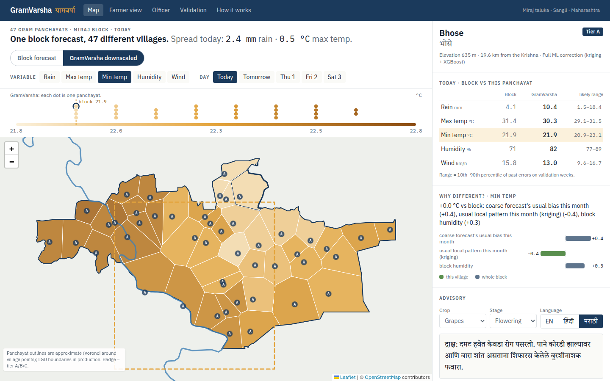
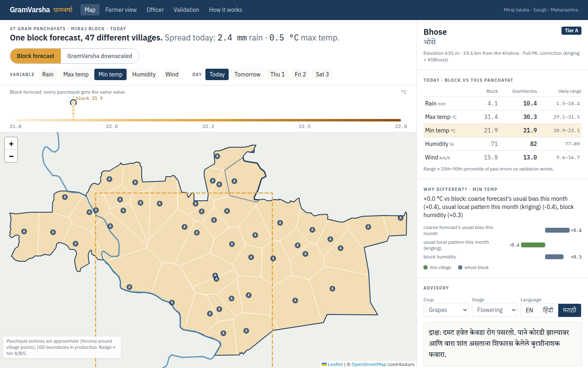
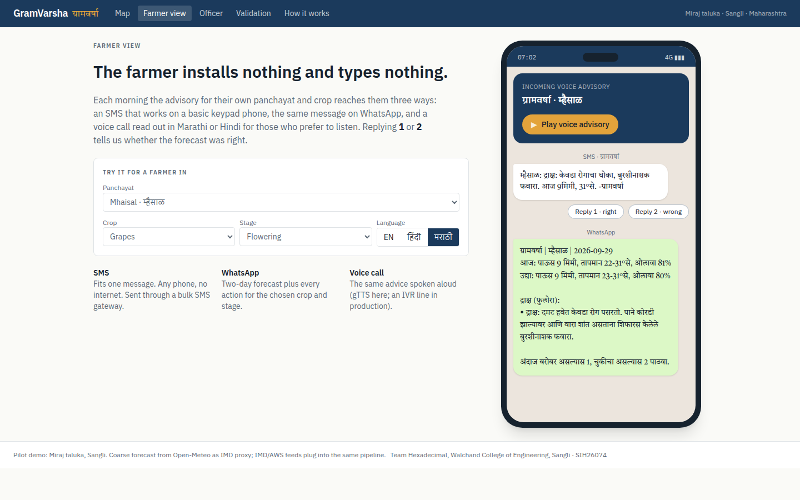
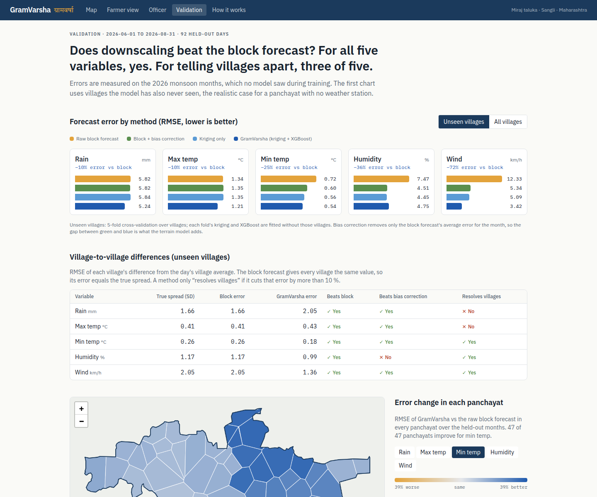
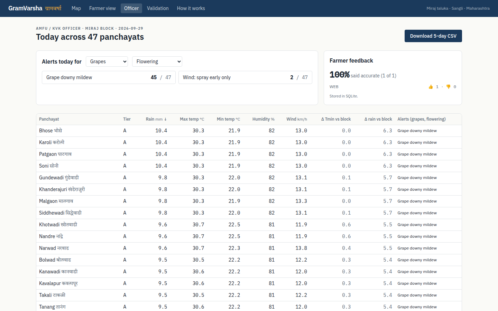

# GramVarsha AI · ग्रामवर्षा

**Smart India Hackathon 2026 · Problem Statement SIH26074 (Ministry of Earth Sciences)**
*Downscaling of weather forecast from Block level to Panchayat level: inferring high-resolution
data from low-resolution data for agro-meteorological advisory services.*
Team **Hexadecimal**, Walchand College of Engineering, Sangli.

GramVarsha takes one coarse block-level forecast and estimates it for each of the 47 gram panchayats
in **Miraj taluka, Sangli**. It uses kriging plus an XGBoost correction on terrain features,
explains every correction with SHAP, and turns the result into crop- and stage-specific advice in
**English, Hindi and Marathi**. The advice goes out by SMS, WhatsApp and voice, and farmer
feedback comes back through replies. Everything runs on free, open data.

**Live demo:** https://gramvarsha-ai.vercel.app · API: https://gramvarsha-api.onrender.com/docs
(The free API sleeps when idle; the site shows its daily snapshot for the first minute while it wakes.)



| Block forecast: every panchayat identical | GramVarsha: each panchayat its own value |
|---|---|
|  |  |

| Farmer view (SMS · WhatsApp · voice) | Validation | Officer view |
|---|---|---|
|  |  |  |

---

## Run it locally

Needs [uv](https://docs.astral.sh/uv/) (it installs Python 3.12) and Node 20+.

```bash
make setup     # Python env + npm install (once)
make dev       # API on :8000 and website on :3000
```

Or use two terminals: `make api` and `make web`. Then open http://localhost:3000.

Useful deep links for demos: `/?mode=block&var=tmin`, `/?var=wind&p=mhaisal`.

```bash
make test      # 43 pytest tests: features, lapse rate, tiers, advisory rules, API
make lint      # TypeScript + ESLint
make docker    # build and run the API image on :7860
```

## How it works

```
GFS block forecast ─┐
 (IMD proxy)        │     ┌───────────┐   ┌──────────────┐   ┌──────┐   ┌──────────────┐   ┌─────────────────────┐
DEM · OSM villages ─┼───► │  Kriging  │──►│ XGBoost      │──►│ SHAP │──►│ Rules engine │──►│ SMS · WhatsApp ·    │
 · Krishna river    │     │ (monthly  │   │ residual     │   │      │   │ en / hi / mr │   │ voice (gTTS)        │
                    │     │ residual) │   │ correction   │   └──────┘   └──────────────┘   └─────────┬───────────┘
                    │     └───────────┘   └──────────────┘                                          │
                    └──────────────── retraining ◄── station CSVs + farmer feedback ◄───────────────┘
```

| Step | File |
|---|---|
| Fetch + cache all open data | `scripts/fetch_data.py` |
| Features shared by training and serving | `ml/features.py`, `ml/terrain.py` |
| Pair block value with village value, time split | `ml/build_dataset.py` |
| Ordinary kriging of monthly residuals (variogram by leave-one-village-out CV) | `ml/kriging.py` |
| Block → kriged residual → XGBoost correction (log1p for rain), error bands | `ml/model.py` |
| Honest evaluation (time holdout + unseen villages) | `ml/evaluate.py` → `ml/metrics.json` |
| SHAP → sentences, village-specific vs block-wide | `ml/explain.py` |
| Physics fallback (lapse rate 6.5 °C/km, orographic rain) | `ml/physics.py` |
| Live forecast, tiers A/B/C, stale handling | `backend/forecast.py` |
| Advisory rules + hand-written en/hi/mr text | `backend/advisory.py`, `backend/advisory_text.py` |
| Optional Groq rewrite (rejected if any number changes) | `backend/llm.py` |
| Voice, feedback storage, API | `backend/tts.py`, `backend/db.py`, `backend/main.py` |

**It never fails silently.**

- **Tier A:** full ML correction.
- **Tier B:** physics only, used if the models are missing.
- **Tier C:** the block value, flagged "limited local data".
- **Forecast source down:** the API serves the last good forecast marked "stale since …".
- **API down:** the website loads `frontend/public/snapshot*.json`, regenerated daily by the same pipeline, and says so on screen.

## Data (all free, no credit card)

| Need | Source | Honest note |
|---|---|---|
| Block forecast | Open-Meteo Forecast / Historical Forecast API, **GFS 0.25°** at the taluka centroid | Stands in for IMD's block forecast, which has no open API. Training and live use the same model. |
| Village "truth" | Open-Meteo Archive API, **ECMWF IFS ~9 km** at each village | Pseudo ground truth. Open-Meteo's ERA5-Land has no rain or wind. |
| Terrain | Copernicus GLO-90 DEM via Open-Meteo Elevation API | 5×5 patch per village → slope, aspect, TPI |
| Villages, boundary | OpenStreetMap (Overpass), Miraj relation 9742028 (LGD 4302) | 47 villages. Panchayat polygons are **approximate Voronoi cells**. |
| River | OpenStreetMap (Nominatim), Krishna relation 337204 | Distance computed in UTM 43N |

Model data is requested with `elevation=nan`, so Open-Meteo applies no terrain correction of its
own. Any terrain effect comes from our model. Period: 2024-09-01 to 2026-08-31, cached in
`data/raw/` and committed.

## Results (held-out June–August 2026, villages never seen in training)

RMSE, lower is better. Regenerate with `make evaluate`. The live numbers are on `/validation`.

| Variable | Raw block | Block + bias correction | Kriging | **GramVarsha** | vs block | Resolves village differences? |
|---|---|---|---|---|---|---|
| Max temp °C | 1.34 | 1.35 | 1.35 | **1.21** | 10 % | no |
| Min temp °C | 0.72 | 0.60 | 0.56 | **0.54** | 25 % | yes |
| Rain mm | 5.82 | 5.82 | 5.84 | **5.24** | 10 % | no |
| Humidity % | 7.47 | 4.51 | 4.45 | **4.75** | 36 % | yes |
| Wind km/h | 12.33 | 5.34 | 5.09 | **3.42** | 72 % | yes |

What we tell judges:

- **All five variables beat the raw block forecast**, including on villages the model never saw.
- **Humidity and wind:** much of the gain is removing GFS's systematic bias. The bias-corrected column is there to show that.
- **Max temperature and rainfall:** the gain is a better block-level forecast, not village-level detail.
- **Humidity:** XGBoost is slightly worse than kriging alone. We report it rather than tune on the test set.
- **Terrain features barely appear in XGBoost's top features.** Village detail comes mostly from kriging, and Miraj is flat (under 150 m of relief).
- **Lead time:** scores apply to day 0–1. Days 3–5 are shown in the app but not validated.

## Retraining

```bash
make data       # optional: re-download everything (slow; cached copy is committed)
make retrain    # dataset → kriging + XGBoost → evaluate → snapshot
```

Model settings are fixed in `ml/model.py` and are never tuned on the test months.
- **Test months:** the last 3 months.
- **Validation weeks:** every 5th week before that, with 3-day gaps on each side. They're used only for early stopping and for choosing kriging vs kriging + XGBoost per variable.

## Plugging in real IMD / AWS data

- **Station observations:** put CSVs in `data/imd_import/` (format in [data/imd_import/README.md](data/imd_import/README.md)), then run `make retrain`. Station rows replace the pseudo-truth for those villages and days.
- **IMD block forecast feed:** replace `fetch_block_forecast()` in `backend/forecast.py`. It returns a daily table with `block_tmax, block_tmin, block_rain, block_rh, block_wind`. Retrain on archived IMD forecasts so training and serving match.
- **Official boundaries:** replace `data/voronoi.geojson` with LGD / Bhunaksha polygons that carry the same `id` property.

## Environment variables

| Where | Variable | Default | Purpose |
|---|---|---|---|
| frontend | `NEXT_PUBLIC_API_URL` | `http://localhost:8000` | Backend URL |
| backend | `ALLOWED_ORIGINS` | – | Extra CORS origins (localhost and `*.vercel.app` are always allowed) |
| backend | `REFRESH_HOURS` | `3` | Forecast refresh interval |
| backend | `DATABASE_URL` | – | Postgres, e.g. Supabase free tier. Default is SQLite in `backend/cache/` |
| backend | `GROQ_API_KEY` | – | Enables the optional LLM rewrite. Rules work without it. |
| backend | `GROQ_MODEL` | `llama-3.3-70b-versatile` | Groq model name |
| backend | `DISABLE_REFRESH` | – | `1` = serve only cached/snapshot data (offline demo) |

## Deploy (free)

**Backend → Render free web service (Docker image, 512 MB RAM; the API uses ~260 MB).**
Hugging Face now requires PRO for Docker Spaces, so the API image is pulled from Docker Hub instead.

1. Create free accounts at hub.docker.com and render.com (no card needed).
2. `docker login`, then `make deploy-api IMAGE=<dockerhub-user>/gramvarsha-api`.
   If you want the Docker Hub repository private, create it as private first; you then add a registry credential in Render.
3. In Render, go to New → Web Service → Existing image and enter `docker.io/<dockerhub-user>/gramvarsha-api:latest`. Pick instance type **Free**.
4. Optional environment variables:
   - `DATABASE_URL` (Supabase), so feedback survives restarts. The free disk is wiped on every redeploy and sleep.
   - `GROQ_API_KEY`
5. Copy the service's Deploy Hook URL. Later redeploys are then `RENDER_DEPLOY_HOOK=... make deploy-api IMAGE=...`.
6. Check `https://<service>.onrender.com/api/health`.

The free service sleeps after 15 minutes idle, and waking takes about a minute. In the meantime the
website shows the bundled snapshot, then switches to live data on the next load. Open the site
a minute before judging.

**Frontend → Vercel (Hobby).**

1. Import the GitHub repo and set **Root Directory = `frontend`**.
2. Add env `NEXT_PUBLIC_API_URL=https://<service>.onrender.com`.
3. Go to Settings → Deployment Protection and turn **Vercel Authentication off** so judges can open it.

**Daily snapshot.** `.github/workflows/refresh-snapshot.yml` runs at 06:00 IST, regenerates the
offline fallback from the live pipeline, and commits it (which redeploys Vercel). Allow Actions to
write in Settings → Actions → Workflow permissions.

## Limitations

- The "truth" is a 9 km model, not rain gauges. The 47 villages fall in 17 grid cells.
- Panchayat outlines are approximate. Marathi village names are hand-transliterated and need local checking (`data/village_names.csv`, column `checked`).
- Advisory thresholds are general rules of thumb and need review by Sangli KVK / AMFU.
- gTTS needs internet. The production path is an IVR provider.
